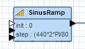
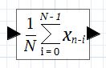
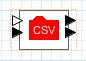

A main deliverable of [Triquetrum](https://projects.eclipse.org/projects/technology.triquetrum) is a graphical editor based on [Graphiti](https://eclipse.org/graphiti/) to design and run [Ptolemy II](http://ptolemy.eecs.berkeley.edu/ptolemyII/) workflows. Graphiti is built on GEF but provides an own EMF-based model and API to define the graphical elements in a diagram, and their links to corresponding domain objects. The core concepts in this API are *PictogramElements* and *GraphicsAlgorithms*. These get rendered as [Draw2d](https://eclipse.org/gef/draw2d/index.php) figures.

Whereas the API-based approach for defining figures offers many nice features (check the [Graphiti](https://eclipse.org/graphiti/) site for a good introduction to the benefits and underlying ideas), it does result in a lot of required coding when the editor needs to support many different graphical shapes. And this happens to be the case for Triquetrum, as each type of workflow component (*actors* in Ptolemy II) can have a custom icon. Furthermore Ptolemy II comes with a large library of existing actor implementations, and most of them have an existing custom icon definition, either stored in a MoML XML file or in SVG fragments.

As a consequence we've investigated the feasibility of reusing the existing SVG and MoML icon definitions as custom figure definitions in a Graphiti-based editor.
The text below describes in detail how this has been implemented.

> The text is quite long, but should be of interest for anyone working with Graphiti and with an interest in supporting externally defined shapes, e.g. in SVG.
> The described mechanism can be reused for integrating other graphical "languages" with Graphiti, i.e. besides SVG.

## Actors and their diagram shapes
> In Ptolemy II most components of a workflow model are *actor* instances.
> Actors can receive data via input *ports*, perform some well-defined processing and produce results via their output ports.

The default shape for an actor in a Triquetrum workflow diagram is an evolution of the EClass shape in [Graphiti's tutorial](http://help.eclipse.org/mars/topic/org.eclipse.graphiti.doc/resources/docu/gfw/scenario-description.htm?cp=36_1_0) :



As in the Graphiti tutorial, the "main" shape is a rounded rectangle. The differences with the tutorial shapes are :
* adding input and output ports
* showing configuration parameters (will probably change)
* adding a small icon image at the top-left

Our goal is for externally-defined custom figure definitions to replace the rounded rectangle and its contents, while maintaining similar port layouts.
For example, for Ptolemy II's MovingAverage actor :



This actor shape is defined in a file similar to (just a part of it):

```xml
<?xml version="1.0" standalone="no"?>
<!DOCTYPE property PUBLIC "-//UC Berkeley//DTD MoML 1//EN"
    "http://ptolemy.eecs.berkeley.edu/xml/dtd/MoML_1.dtd">
<property name="MovingAverageIcon" class="ptolemy.vergil.icon.EditorIcon">
    <property name="rectangle" class="ptolemy.vergil.kernel.attributes.RectangleAttribute">
        <property name="_location" class="ptolemy.kernel.util.Location" value="[-35.0, -20.0]">
        </property>
        <property name="width" class="ptolemy.data.expr.Parameter" value="60">
        </property>
        <property name="height" class="ptolemy.data.expr.Parameter" value="40">
        </property>
    </property>
    <property name="line" class="ptolemy.vergil.kernel.attributes.LineAttribute">
        <property name="_location" class="ptolemy.kernel.util.Location" value="[-15.0, -9.0]">
        </property>
        <property name="x" class="ptolemy.data.expr.Parameter" value="15.0">
        </property>
        <property name="y" class="ptolemy.data.expr.Parameter" value="0.0">
        </property>
    </property>
...
</property>

```

## Graphiti support for custom figures
Information on how to plug-in/reuse externally defined custom figures was obtained via the [Graphiti forum](https://www.eclipse.org/forums/index.php/f/187/), e.g. at :
* [Using SVG figures?](https://www.eclipse.org/forums/index.php/m/650289/)
* [Support for using SVG figures/shapes](https://www.eclipse.org/forums/index.php/t/1075351/)

and via a short code example at *Code and Stuff*:
* [Graphiti PlatformGraphicsAlgorithms](http://satreth.blogspot.be/2012/03/graphiti-platform-gas.html)

This boils down to 3 steps :

1. The AddFeature for the respective model element type should create a *PlatformGraphicsAlgorithm*, i.o. composing the shape using standard Graphiti GraphicalAlgorithms, using something like :

   ```
   GraphicsAlgorithm extFigure = Graphiti.getGaCreateService().createPlatformGraphicsAlgorithm(containerGA, someId);
   ```
2. You need to provide an implementation of a *IGraphicsAlgorithmRendererFactory* and register it in your editor's *DiagramTypeProvider* by overriding the dedicated method, e.g. :

   ```
    @Override
    public IGraphicsAlgorithmRendererFactory getGraphicsAlgorithmRendererFactory() {
     if (factory == null) {
       factory = new TriqGraphicsAlgorithmRendererFactory();
     }
     return factory;
    }
   ```
3. That factory must create custom implementations of *org.eclipse.draw2d.Shape* marked with an interface *IGraphicsAlgorithmRenderer*. These are invoked during the diagram's rendering, to provide the desired custom shape.

## Applying this in Triquetrum
In the solution approach described above, there is an indirection between step 1 and steps 2 & 3. The AddFeature's created PlatformGraphicsAlgorithm just provides an abstract wrapper on what will eventually get rendered, but is unable itself to pass concrete shape information back to the Addfeature. The factory and shape implementations only get invoked during the rendering of a Diagram and it's only at that moment that we're able to interpret the shape's definition in detail.

Concretely this means that the AddFeature has no way to obtain detailed formatting/sizing information for the specific shape definition (unless we start duplicating specific parsing logic etc in there, which we don't want to). This is a deviation from the approach for Graphiti "native" shape construction, where the AddFeature is responsible for setting the actual sizes. And it leads to problems to get the sizing and layout working for the container shape that must combine the port figures with the externally defined shape...

A simple solution would be to enforce standard sizes for all model elements, but this is not acceptable in our case. To be able to handle arbitrary sizes, while maintaining the encapsulation of the actual shape definition technology, the custom shapes in Triquetrum are able to force a resizing of their Graphiti container shape. The details on how this is done are described below.

In Triquetrum, the contents of the editor palette are defined using extensions. Two of the elements that must be specified for a palette entry are :
* *iconType* : `svg`, `ptolemy`, `img`
* *icon* : a plugin relative path to the image file, to be used as the icon for this palette entry.
For `img`, the icon file is assumed to contain a 16x16 image that will be shown at the top-left corner of a default shape for the corresponding diagram element.
For `svg` or `ptolemy` the icon file is assumed to define the complete shape of the diagram element.

The configured palette entries are mapped to *ModelElementCreateFeature*s in our *TriqFeatureProvider*.
When a model designer drag-n-drops an actor from the palette on the model canvas, the properties of the palette entry get passed along from the *ModelElementCreateFeature* to the relevant *AddFeature*.
Then for example the *ActorAddFeature* checks the iconType property that was passed along and determines which shape generation approach must be triggered.

When the actor has an externally defined shape, the *ActorAddFeature* invokes :

```
protected GraphicsAlgorithm buildExternallyDefinedShape(IGaService gaService, GraphicsAlgorithm invisibleRectangle,
                                    ContainerShape containerShape, String iconType, String iconResource) {

    GraphicsAlgorithm extFigure = Graphiti.getGaCreateService().createPlatformGraphicsAlgorithm(invisibleRectangle,
                                    iconType);
    Property property = MmFactory.eINSTANCE.createProperty();
    property.setKey("iconType");
    property.setValue(iconType);
    extFigure.getProperties().add(property);

    property = MmFactory.eINSTANCE.createProperty();
    property.setKey("iconResource");
    property.setValue(iconResource);
    extFigure.getProperties().add(property);

    // We need to set an arbitrary non-0 size to get things working in the shape implementations.
    // This size will be changed as needed by the figure, depending on its actual defined size.
    gaService.setLocationAndSize(extFigure, SHAPE_X_OFFSET, 0, 40, 40);
    return extFigure;
}
```

This triggers the creation of our custom shape implementation, and passes the icon definition information along.

When the diagram gets rendered, Graphiti triggers the creation of the actual custom shape via the *TriqGraphicsAlgorithmRendererFactory*.
This one then creates a shape instance of the right type, matching the configured iconType :

```
public class TriqGraphicsAlgorithmRendererFactory implements IGraphicsAlgorithmRendererFactory {

  @Override
  public IGraphicsAlgorithmRenderer createGraphicsAlgorithmRenderer(IRendererContext rendererContext) {
    String iconType = null;
    for (Property property: rendererContext.getPlatformGraphicsAlgorithm().getProperties()) {
      if("iconType".equalsIgnoreCase(property.getKey())) {
        iconType = property.getValue();
        break;
      }
    }
    switch(iconType) {
    case TriqFeatureProvider.ICONTYPE_PTOLEMY :
      return new PtolemyModelElementShape(rendererContext);
    case TriqFeatureProvider.ICONTYPE_SVG :
      return new SvgModelElementShape(rendererContext);
    default :
      return null;
    }
  }
}
```

Finally, the shape implementation must read its icon definition and must transform it in a visible shape.

## SVG implementation details
SVG-based definitions are handled by *org.eclipse.triquetrum.workflow.editor.shapes.svg.SvgModelElementShape*, which uses Batik and a simplified version of GMF's [SVGFigure](http://git.eclipse.org/c/gmf-tooling/org.eclipse.gmf-tooling.git/tree/plugins/org.eclipse.gmf.runtime.lite.svg/src/org/eclipse/gmf/runtime/lite/svg/SVGFigure.java).

As an example, Ptolemy II's CSVReader actor has an icon defined as :

```xml
<svg x="-25" y="-20" width="50" height="40" style="overflow: visible">
<rect x="-25" y="-20" width="50" height="40" style="fill:white"/>
<polygon points="-15,-10 -12,-10 -8,-14 -1,-14 3,-10 15,-10 15,10, -15,10" style="fill:red"/>
<text x="-11" y="4" style="font-size:11; fill:white; font-family:SansSerif">CSV</text>
</svg>
```

which should result in something like :



Rendering the actor shape involves following steps :
1. Determine the bounds of the defined shape
2. Update the size of the container shape to match the determined bounds
3. Translate SVG coordinates to a top-left origin of (0,0)
4. Paint the SVG figure

> Ideally the SVG definition would only need a single parsing from which we could obtain size info and trigger the rendering.
> The current usage of GMF's SVGFigure and Batik does not support this, so there's room for optimization here!

### Determining the SVG shape's bounds
*SvgModelElementShape* does this as follows, using Batik :

```
private Rectangle determineExtremeBounds(String uri) throws IOException {
  LOGGER.trace("SVG determineExtremeBounds - entry - for {}", uri);
  String parser = XMLResourceDescriptor.getXMLParserClassName();
  parser = parser != null ? parser : "org.apache.xerces.parsers.SAXParser";
  SAXSVGDocumentFactory factory = new SAXSVGDocumentFactory(parser);
  Document doc = factory.createDocument(uri);
  UserAgent agent = new UserAgentAdapter();
  DocumentLoader loader = new DocumentLoader(agent);
  BridgeContext context = new BridgeContext(agent, loader);
  context.setDynamic(true);
  GVTBuilder builder = new GVTBuilder();
  GraphicsNode root = builder.build(context, doc);
  int height = (int) root.getGeometryBounds().getHeight();
  int width = (int) root.getGeometryBounds().getWidth();
  int minX = (int) root.getGeometryBounds().getMinX();
  int minY = (int) root.getGeometryBounds().getMinY();

  Rectangle result = new Rectangle(minX, minY, width, height);
  LOGGER.trace("SVG determineExtremeBounds - exit - for {} - bounds {}", uri, result);
  return result;
}
```

### Updating the size of the container shape
This is where the custom figure implementation must reach back into Graphiti to obtain a *ResizeShapeFeature* for its container shape and to execute it on Graphiti's editing domain's command stack. As the shape rendering is done outside of the normal Graphiti feature processing flow, there's some extra work required here to set that up :

```
  protected void setInitialSize(GraphicsAlgorithm ga, int width, int height) {
    if(!getGaProperty("renderDone").isPresent()) {
      final TransactionalEditingDomain editingDomain = dtp.getDiagramBehavior().getEditingDomain();
      final IFeatureProvider fp = dtp.getFeatureProvider();

      final RecordingCommand command = new RecordingCommand(editingDomain, getIconURI()) {
        private IStatus result = null;

        @Override
        protected void doExecute() {
          try {
            GraphicsAlgorithm parentGA = ga.getParentGraphicsAlgorithm();
            ResizeShapeContext context = new ResizeShapeContext((Shape) parentGA.getPictogramElement());
            // the extra 15 is to provide space for the port figures
            context.setSize(width+15, height);
            context.setX(parentGA.getX());
            context.setY(parentGA.getY());
            context.putProperty("forced", "true");
            IResizeShapeFeature resizeShapeFeature = fp.getResizeShapeFeature(context);
            if(resizeShapeFeature!=null) {
              resizeShapeFeature.resizeShape(context);
            }
            addGaProperty("renderDone", "true");
            result = Status.OK_STATUS;
          } catch (OperationCanceledException e) {
            result = Status.CANCEL_STATUS;
          }
        }

        @Override
        public Collection<?> getResult() {
          return result == null ? Collections.EMPTY_LIST : Collections.singletonList(result);
        }
      };

      // Execute (synchronously) the defined command in a proper EMF transaction
      editingDomain.getCommandStack().execute(command);
    }
  }
```

### Translating the SVG coordinates
The SVG definition is free to use negative (x,y) coordinates. This is not the case for rendering something in a draw2d shape, which assumes that the top-left corner is at the (0,0) origin.

To support a translate transformation to the (0,0) origin, and at the same time to avoid bringing in loads of GMF dependencies, the GMF SVGFigure has been extracted and simplified a bit. And we have added support for coordinates translation :

```
    figure.setTranslateX(-minX);
    figure.setTranslateY(-minY);
```

### Paint the figure
Finally, we can just invoke *SVGFigure.paint()*. *SvgModelElementShape.fillShape()* performs the 4 steps as follows :

```
@Override
protected void fillShape(Graphics graphics) {
  LOGGER.trace("SVG fillShape - entry - for {}", getIconURI());
  try {
    svgShapeBounds = svgShapeBounds != null ? svgShapeBounds : determineExtremeBounds(getIconURI());
    int minX = svgShapeBounds.x;
    int minY = svgShapeBounds.y;
    int width = svgShapeBounds.width;
    int height = svgShapeBounds.height;
    setInitialSize(ga, width, height);

    SVGFigure figure = new SVGFigure();
    // move SVG figure from its defined top-left to origin (0,0) top-left
    figure.setTranslateX(-minX);
    figure.setTranslateY(-minY);
    figure.setURI(getIconURI());
    figure.setBounds(this.getBounds());
    figure.paint(graphics);
  } catch (IOException e) {
    LOGGER.error("Error drawing SVG shape "+getIconURI(), e);
  }
  LOGGER.trace("SVG fillShape - exit - for {}", getIconURI());
}
```

> Remark that *SVGFigure.paint()* results in an SWT Image. So the result is no longer scalable/vectorial.
> The Ptolemy MoML icon definitions on the other hand have been implemented on corresponding draw2d concepts, and behave better as a consequence.
> If anyone would be willing to implement a full/partial SVG-draw2d bridge that would be fantastic of course!

## Conclusion
We have described an approach to use Graphiti's available mechanisms for rendering custom figures to reuse large collections of existing externally defined figures.
The most important issue to address was to support custom sizes in those figure definitions. This has been addressed by having the custom figure implementations invoke a Graphiti resize feature.

At this stage of Triquetrum, the above approach caters to our needs. But there is still room for improvement on several aspects :
* SVG figures render as plain SWT Images and thus loose their nice scaling.
* We need better control on the frequency of invoking the fillShape() method. Graphiti (or GEF or Draw2D?) seem to be invoking it way too much, and this induces a performance overhead.
* It could be a good idea to provide shortcuts in Graphiti to allow accessing the custom figure information from inside the AddFeature implementation.
This would lead to more uniformity between handling Graphiti native shapes and custom figures, and would avoid the need for the figure implementations to "call back" into Graphiti features and command stacks.
* ... any other ideas?

> The full source code can be found at the [Triquetrum Github repository](https://github.com/eclipse/triquetrum).

You can discover and follow Triquetrum via :
* The project site at : https://projects.eclipse.org/projects/technology.triquetrum
* Source repository at : https://github.com/eclipse/triquetrum
* Mailing list : https://dev.eclipse.org/mailman/listinfo/triquetrum-dev

