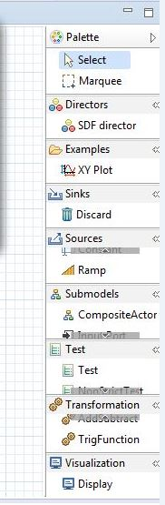
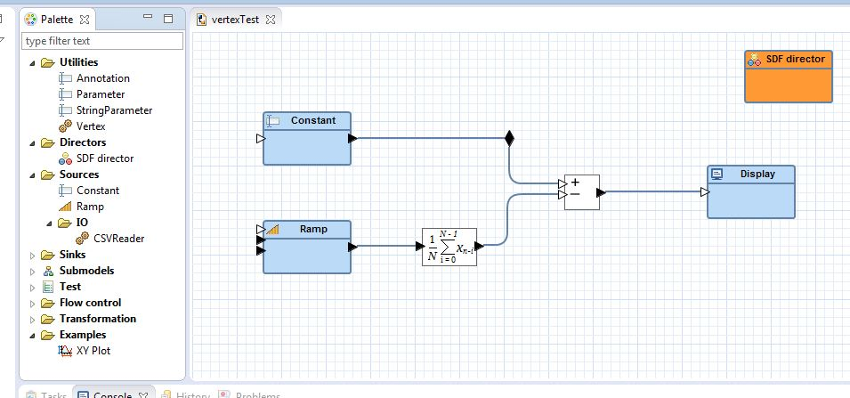
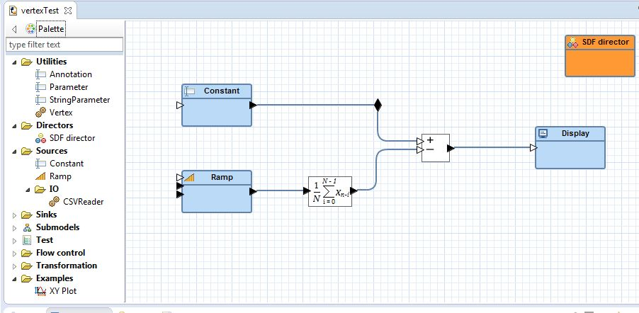
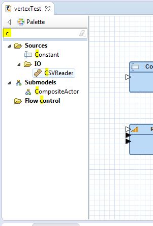

[Triquetrum](https://projects.eclipse.org/projects/technology.triquetrum) delivers a graphical editor based on [Graphiti](https://eclipse.org/graphiti/) to design and run [Ptolemy II](http://ptolemy.eecs.berkeley.edu/ptolemyII/) workflows. Graphiti is built on GEF 3 and as such provides the traditional GEF palette look-and-feel with drawers, for example :



This is fine as long as the palette does not need to contain too many groups or entries. Then the drawers start using too much space, leaving virtually no room to show the actual palette entries, and navigating the palette starts getting difficult.

For such cases, a tree-based palette view can be an improvement. Trees also permit to represent a hierarchy i.o. just a single level of drawers.

With [Passerelle](https://github.com/eclipselabs/passerelle), the Triquetrum predecessor, we had chosen to disable the standard Graphiti/GEF palette and to implement a totally separate tree-based view and our own drag-n-drop logic to mimic the behaviour of an editor palette. Besides a lot of duplication, another disadvantage is that someone can still activate the "normal" editor palette, which may lead to confusion.

With Triquetrum we wanted to maintain the Graphiti/GEF palette handling as much as possible, and to try to just replace the actual rendering by our tree-based alternative, instead of using drawers.

Here is the result :

* The GEF palette view with a tree



* And as a flyout palette




* And filtered to items with a 'c'




Read along to find out how this was done!

> Remark that all of the below relates to GEF 3, which is what Graphiti is built on.

## Preparing the Palette customization
Graphiti offers a multi-step approach to defining a custom palette view.

* Define a custom DiagramEditor if you haven't already done so, e.g. a TriqDiagramEditor, and register that on the "org.eclipse.ui.editors" extension point in your plugin.xml. E.g. :

   ```xml
   ...
   <extension point="org.eclipse.ui.editors">
    <editor
          class="org.eclipse.triquetrum.workflow.editor.TriqDiagramEditor"
          contributorClass="org.eclipse.graphiti.ui.editor.DiagramEditorActionBarContributor"
          default="true"
          extensions="tdml"
          icon="icons/model.gif"
          id="org.eclipse.triquetrum.workflow.editor.TriqDiagramEditor"
          matchingStrategy="org.eclipse.graphiti.ui.editor.DiagramEditorMatchingStrategy"
          name="Triquetrum model editor">
       <contentTypeBinding contentTypeId="org.eclipse.triquetrum.workflow.model" />
    </editor>
   </extension>
   ...
   ```
* Define a custom DiagramBehavior implementation in your custom DiagramEditor. E.g.

   ```
   public class TriqDiagramEditor extends DiagramEditor {
   ...
     @Override
     protected DiagramBehavior createDiagramBehavior() {
       return new TriqDiagramBehavior(this);
     }
   ...
   }
   ```
* In the custom DiagramBehavior, create a custom PaletteBehavior. E.g. :

   ```
   public class TriqDiagramBehavior extends DiagramBehavior {
   ...
     @Override
     protected DefaultPaletteBehavior createPaletteBehaviour() {
       return new TriqPaletteBehavior(this);
     }
   ...
   }
   ```
* Finally, in your custom PaletteBehavior, create a custom PaletteViewerProvider, e.g. a PaletteTreeViewerProvider.

   ```
   public class TriqPaletteBehavior extends DefaultPaletteBehavior {
   ...
     @Override
     protected PaletteViewerProvider createPaletteViewerProvider() {
       return new PaletteTreeViewerProvider(diagramBehavior);
     }
   ...
   }
   ```

> Now we're entering into the GEF palette internals!


## To Filter a Tree
Once we can define our own PaletteViewerProvider, we should be set for using other SWT or JFace components as a palette representation, or not?

It appears that GEF has constrained the options somewhat though. Lots of elements in the GEF implementation are directly depending on the fact that an org.eclipse.gef.ui.palette.PaletteViewer is used. And that one implements both org.eclipse.gef.EditPartViewer and org.eclipse.gef.GraphicalViewer, i.e. all GEF and no JFace or SWT.

As a consequence it's not straightforward to just replace the default palette view's contents by a org.eclipse.jface.viewers.TreeViewer or even by a org.eclipse.gef.ui.parts.TreeViewer (which is not a GraphicalViewer).

To complicate matters even further Triquetrum needs to be able to search or filter in the palette so we would really like to use org.eclipse.ui.dialogs.FilteredTree. And that one contains its own TreeViewer implementation, conflicting again with what GEF's PaletteViewer requires.

To conclude, the goal is to be able to :

* build a palette containing "normal" Graphiti/GEF EditParts for PaletteEntries, ToolEntries etc so the standard drag-n-drop works with linking to Graphiti's CreateFeatures.
* present the palette as a FilteredTree
* allow the user to decide on using either the flyout palette or the separate palette page as is standard for GEF editors

## Enter the hacker
GEF requires that we keep on providing a PaletteViewer, so our PaletteTreeViewerProvider will create a subclass, our own PaletteTreeViewer.

Whereas viewers typically create their SWT Controls in ... createControl(), this is not possible here as GEF's base-class org.eclipse.gef.ui.parts.ScrollingGraphicalViewer has marked that method as final. Luckily there's still a setControl() to the rescue, invoked from our own new PaletteTreeViewer.createTreeControl() method :

   ```
   public Control createTreeControl(Composite parent) {
     PatternFilter filter = new PatternFilter();
     FilteredTree tree = new FilteredTree(parent, SWT.MULTI | SWT.H_SCROLL | SWT.V_SCROLL, filter, true);
     tree.setLayoutData(new GridData(SWT.FILL, SWT.FILL, true, true));
     ...
     setControl(tree);
     return tree;
   }
   ```

And to prevent NPEs and other weirdness, we need to allow the graphical viewer base classes to get their FigureCanvas anyway, overriding getFigureCanvas() in our PaletteTreeViewer :

   ```
   // hack to use a dummy canvas to please the graphical base classes
   @Override
   protected FigureCanvas getFigureCanvas() {
     if (figCanvas == null) {
       figCanvas = new FigureCanvas(getControl().getParent());
     }
     return figCanvas;
   }
   ```

Remark that this figCanvas is never actually used, but only serves to prevent initialization errors in the base classes.

## Representing a palette tree hierarchy
PaletteTreeViewer duplicates some features of org.eclipse.gef.ui.parts.TreeViewer and as such works with TreeEditPart implementations instead of using GraphicalEditParts as in the standard GEF PaletteViewer. The root edit part is set to a standard RootTreeEditPart, which does not make the GraphicalViewerImpl too happy. It causes a ClassCastException which we can luckily ignore.

   ```
   @Override
   protected void createDefaultRoot() {
     try {
       setRootEditPart(new RootTreeEditPart());
     } catch (ClassCastException e) {
       // to catch the wrong cast to a GraphicalEditPart in the GraphicalViewerImpl.setRootEditPart implementation
     }
   }
   ```


Triquetrum provides TreeEditPart implementations in PaletteEntryEditPart and PaletteTreeNodeEditPart, the latter used to represent a node in the tree hierarchy. Actual entries, i.e. tree leaves, are plain PaletteEntryEditParts.

These edit parts contain org.eclipse.gef.palette.PaletteEntry model objects. The PaletteTreeNodeEditParts refer to org.eclipse.gef.palette.PaletteContainers. GEF's PaletteDrawer is not able to represent more than 1 level in a palette hierarchy, so we have added a PaletteTreeNode that allows nesting palette containers.

Finally, by registering a PaletteTreeProvider and a PaletteLabelProvider the tree can be visualized based on the hierarchy of palette entries and edit parts.

## Conclusion


> The full source code can be found at the [Triquetrum Github repository](https://github.com/eclipse/triquetrum).

You can discover and follow Triquetrum via :

* The project [site](https://projects.eclipse.org/projects/technology.triquetrum)
* Source [repository](https://github.com/eclipse/triquetrum)
* Mailing [list](https://dev.eclipse.org/mailman/listinfo/triquetrum-dev)

